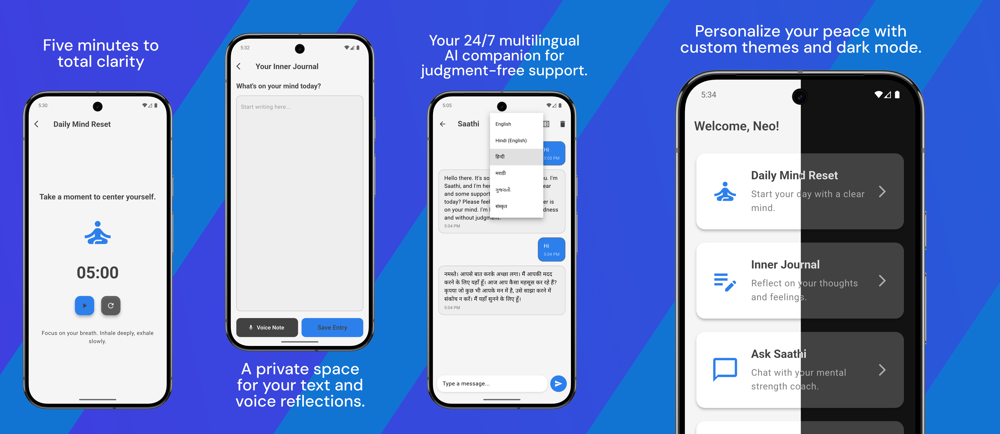

<div align="center">
  <h1>Saathi</h1>
  
  <br />
  <br />
  <a href="https://github.com/neo999in/Saathi/releases/download/Android/app-release.apk"></a><br>
</div>

---
### 📖 Description

**Saathi** is an AI-powered companion designed for emotional well-being. It provides a safe, private, and culturally-aware space where youth can share their feelings, reflect, and find comfort—anytime, anywhere. Built with empathy at its core, Saathi helps users navigate their emotions through AI-driven conversations, journaling, and mindfulness exercises.

> [!IMPORTANT]
> **Disclaimer**: Saathi is an AI-powered tool for emotional support and self-reflection. It is **not a substitute for professional mental health care, clinical therapy, or medical advice.** If you are in a crisis, please seek professional help immediately.

---

### 📸 Screenshots
<div align="center">
  
</div>
  
---

### ✨ Features
- 🤖 **Anonymous AI Chatbot**: 24/7 multilingual support built with Google Gemini for judgment-free emotional guidance.
- 📓 **Mood Journal**: A private space for text and voice journaling to track and reflect on your emotional journey.
- 🎭 **Generative Storytelling**: Creative coping through personalized AI-generated narratives based on your current feelings.
- 🧘 **Daily Mind Reset**: Guided 5-minute meditation and breathing exercises to help you center yourself.
- 🎮 **Mental Modules**: Interactive drills, cognitive flexibility games, and mental agility exercises.
- 🎨 **Personalized Experience**: Customizable themes and accent colors to create your own digital comfort zone.
- 🔐 **Privacy First**: No personal data collection with strong local persistence for maximum security.

---

### 🛠 Requirements
Before you begin, ensure you have met the following requirements:
* **Flutter SDK**: `^3.8.1` or higher.
* **Dart SDK**: Compatible with the Flutter version.
* **IDE**: [Android Studio](https://developer.android.com/studio) or [VS Code](https://code.visualstudio.com/) with Flutter/Dart plugins.
* **Platform**: 
    - **Android**: SDK 24 (Android 7.0) or higher.
    - **Physical Device** or **Emulator/Simulator** for testing.

---

### 🛠 Tech Stack
<a href="https://flutter.dev/"></a>
<a href="https://dart.dev/"></a>
<a href="https://ai.google.dev/"></a>  
<a href="https://nodejs.org/"></a>
<a href="https://render.com/"></a>
<a href="https://vercel.com/"></a>

- **Key Packages**:
  - `shared_preferences` (Data Persistence)
  - `provider` (State Management)
  - `flutter_sound` & `audioplayers` (Audio Handling)
  - `flutter_tts` (Text-to-Speech)
  - `google_generative_ai` (AI Integration)

---

### 📂 Folder Structure
```text
lib/
├── main.dart              # Core entry point & Home Dashboard
├── AIChatScreen.dart      # Empathic AI Chatbot interface
├── modules.dart          # Interactive mental health exercises
└── audio_note_player.dart # Custom playback for voice journal entries
```
---
### 📄 License

Released under the <a href="./LICENSE"></a>

